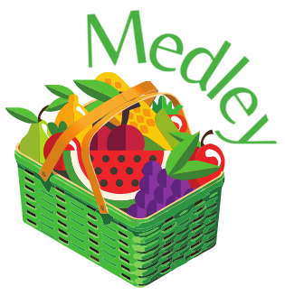

<p align="center">
  
</p>

## Introduction

#### Welcome to Medley!

Medley is a fruitful take on a programming language, with strengths in both enjoyability and ease of use. Medley employs a more natural language approach to programming, all while having a unique theme that makes it both easy and fun to use. The target is for either younger or newer beginning programmers, where a lot of the more complex concepts of programming is simplified by making it similar to English.

We hope you enjoy!

Medley is created by [@Henno Kublin](https://github.com/hjkublin), [@Amanda Marques](https://github.com/amandacmarques), [@Nick Morgan](https://github.com/nmorgan8), [@Megan Richardson](https://github.com/meganmrichardson), [@Josh Seaman](https://github.com/jseaman1), and [@Tigerlilly Zietz](https://github.com/tigerlillyz).

Visit our [website](https://meganmrichardson.github.io/Medley/) to learn more!

View our [Ohm Grammar](src/medley.ohm).

## Contents

- [ Introduction ](#introduction)
- [ Contents ](#contents)
- [ Features ](#features)
- [ Types and Variable Declarations ](#types-and-variable-declarations)
- [ Built in Functions ](#built-in-functions)
- [ Primitive Types ](#primitive-types)
- [ Data Types ](#data-types)
- [ Operators ](#operators)
  - [ Binary Operators ](#binary-operators)
  - [ Unary Operators ](#unary-operators)
- [ Comments ](#comments)
- [ Medley Examples ](#medley-examples)
  - [ If Statements ](#if-statements)
  - [ For Loops ](#for-loops)
  - [ While Loops ](#while-loops)
  - [ Hello World ](#hello-world)
    - [ Javascript ](#javascript)
    - [ Medley ](#medley)
  - [ Fibonacci ](#fibonacci)
    - [ Javascript ](#javascript-1)
    - [ Medley ](#medley-1)
  - [ Number Odd or Even ](#fibonacci)
    - [ Javascript ](#javascript-2)
    - [ Medley ](#medley-2)
  - [ Fahrenheit to Celsius ](#fahrenheit-to-celsius)
    - [ Javascript ](#javascript-3)
    - [ Medley ](#medley-3)
  - [ First Factorial ](#first-factorial)
    - [ Javascript ](#javascript-4)
    - [ Medley ](#medley-4)
  - [ Types of Static Semantic Errors ](#types-of-static-semantic-errors)

## Features

- Statically Typed
- Strongly Typed
- Object Oriented
- Data Structures such as Arrays and Dictionaries
- Built-in Functions

## Types and Variable Declarations

| Keywords in Javascript | Medley       |
| ---------------------- | ------------ |
| function               | blend        |
| return                 | squeeze      |
| if()                   | ifmelon()    |
| else if()              | elifmelon()  |
| else                   | elsemelon    |
| for()                  | formelon()   |
| while()                | whilemelon() |

## Built in Functions

| JavaScript                     | Medley                    |
| ------------------------------ | ------------------------- |
| `console.log(“Hello World!”);` | `juice "Hello World!" \|` |

## Primitive Types

| Types in JavaScript | Types in Medley | Variable Declarations Example       |
| ------------------- | --------------- | ----------------------------------- |
| string              | `stringberry`   | `stringberry title is "medley" \|`  |
| boolean             | `boolberry`     | `boolberry bestLanguagee is gmo \|` |
| int                 | `intberry`      | `intberry teamSize is 6 \|`         |
| float               | `floatberry`    | `floatberry ourIQ is 156.7 \|`      |

| Boolean Types In Javascript | Boolean Types In Medley |
| --------------------------- | ----------------------- |
| `true`                      | `organic`               |
| `false`                     | `gmo`                   |

## Data Types

| Types in Javascript | Types in Medley |
| ------------------- | --------------- |
| Array               | `berrybasket`   |
| Dictionary          | `fruitbasket`   |

| Variable Declaration Example in Javascript         | Variable Declaration Example in Medley                                                         |
| -------------------------------------------------- | ---------------------------------------------------------------------------------------------- |
| let toppings = ["strawberry", "blueberry"];        | `berrybasket~stringberry~ toppings is ~"strawberry" ; "blueberry"~ \|`                         |
| let flavors = {lemon: "tart", starfruit: "sweet"}; | `fruitbasket~stringberry, stringberry~ flavors is ~~"lemon","tart" ; "starfruit","sweet"~~ \|` |

## Operators

### Binary Operators

| Operation                              | Type Compatability           |
| -------------------------------------- | ---------------------------- |
| add `plus`                             | `Strings, Numbers`           |
| subtract `minus`                       | `Numbers`                    |
| multiply `times`                       | `Numbers`                    |
| divide `divby`                         | `Numbers`                    |
| modulus `mod`                          | `Numbers`                    |
| less than `less`                       | `Numbers`                    |
| greater than `more`                    | `Numbers`                    |
| less than or equal to `less equals`    | `Numbers`                    |
| greater than or equal to `more equals` | `Numbers`                    |
| strictly equal `equals`                | `Strings, Numbers, Booleans` |
| logical AND `apple`                    | `Booleans`                   |
| logical OR `orange`                    | `Booleans`                   |

### Unary Operators

| Operation      | Type Compatability |
| -------------- | ------------------ |
| negative `-`   | `Numbers`          |
| negation `nut` | `Booleans`         |
| increment `++` | `Numbers`          |
| decrement `--` | `Numbers`          |

## Comments

- Single Line: `::`

## Medley Examples

### If Statements

```
ifmelon 1 plus 1 equals 2  ->
  juice "this is factual information" |
<-
```

### For Loops

```
formelon intberry i is 10 | i more equals num | i-- ->
  juice "the number is " plus i |
<-
```

### While Loops

```
intberry i is 2 |
whilemelon i less 10 ->
  juice " " plus i |
  i++ |
<-
```

### Hello World

#### Javascript

```
console.log('Hello World');
```

#### Medley

```
juice "Hello, World!" |
```

### Fibonacci

#### Javascript

```
function fibonacci(num) {
    var num1 = 0;
    var num2 = 1;
    var sum;
    var i = 0;
    for (i = 0; i < num; i++) {
        sum = num1 + num2;
        num1 = num2;
        num2 = sum;
    }
    return num2;
}
```

#### Medley

```
intberry blend fibonacci(intberry num) ->
    intberry num1 is 0 |
    intberry num2 is 1 |
    intberry sum |
    intberry i is 0 |
    formelon i is 0 | i less num | i++ ->
        sum is num1 plus num2 |
        num1 is num2 |
        num2 is sum |
    <-
    squeeze num2 |
<-
```

### Number Odd or Even

#### Javascript

```
def odd_or_even(num):
    if(num % 2 == 0) {
        console.log("The number is even.");
    } else {
        console.log("The number is odd.");
    }
```

#### Medley

```
stringberry blend oddOrEven(intberry num) ->
    ifmelon num mod 2 equals 0 ->
        squeeze "The number is even." |
    <- elsemelon ->
        squeeze "The number is odd." |
    <-
<-
```

### Fahrenheit to Celsius

#### Javascript

```
function toCelsius(fahrenheit) {
    return (5/9) * (fahrenheit-32);
}
```

#### Medley

```
floatberry blend toCelsius(floatberry fahrenheit) ->
    squeeze (5 divby 9) times (fahrenheit minus 32) |
<-
```

### First Factorial

#### Javascript

```
function firstFactorial(x) {
    if (x == 0 || x == 1) {
        return 1;
    }
    return x * firstFactorial(x - 1);
}
```

#### Medley

```
intberry blend firstFactorial(intberry num) ->
    ifmelon num equals 0 orange num equals 1 ->
        squeeze 1 |
    <-
    squeeze num times firstFactorial(num minus 1) |
<-
```

### Types of Static Semantic Errors

- Incompatible types
- Type mismatch in declaration
- Types are not compatible
- Variable has already been declared
- Use of a non-initialized variable
- Invalid variable type
- Invalid types used with add, sub, mult, div, or mod
- Incorrect use of unary operator
- Incorrect types of binary operators
- Index out of range
- Function missing return statement
- Mismatched function return type
- Incorrect number of function parameters
- Incorrect type in function call
- Function call does not exist
- Break outside of loops or task
- Unreachable statement
